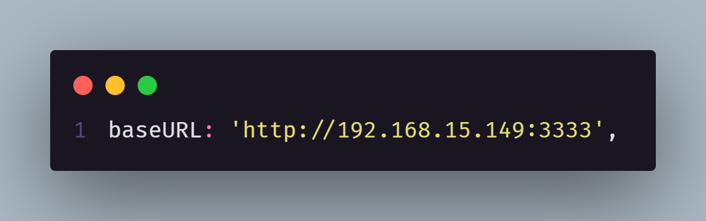

# 💸 Ubank

🔛 **Teste agora: [UbankSHX](https://expo.dev/@lmiguelm/ubank-shx).**

Layout disponível no [Figma](https://www.figma.com/file/CgiDkHWVMnpVw3LAYaRpqr/SHX).

 

## 🚨 IMPORTANTE 🚨

  Este projeto foi desenvolvido utilizando o Expo, então certifique-se
  de ter o expo instalado, caso não possua, execute o comando abaixo:

`npm install --global expo-cli`

 

Antes de executar o projeto, localize o **_packge.json_** e altere a linha 5, colocando na frente da flag **"--host"** o IP local de sua máquina. Como no exemplo abaixo:

Também alterar o arquivo **_api.ts_** colocando o IP e HOST que foram inseridos no **_packge.json_**. Como no exemplo abaixo:

 

## 💻 Como usar

- **_Clone o projeto:_** 
  `git clone https://github.com/lmiguelm/ubank-shx`

 

- **_Entre na pasta do projeto:_** 
  `cd ubank-shx`

 

- **_Baixe as dependências:_** 
  ` yarn || npm install`

 

- **Rodar o servidor** 
  `yarn server || npm run server`

 

- **Rodar a aplicação:\_** 
  `yarn start || npm run start`

 
